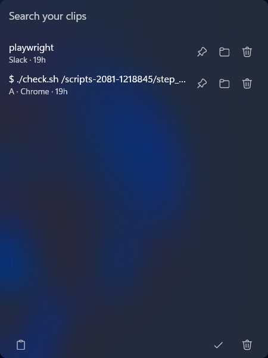
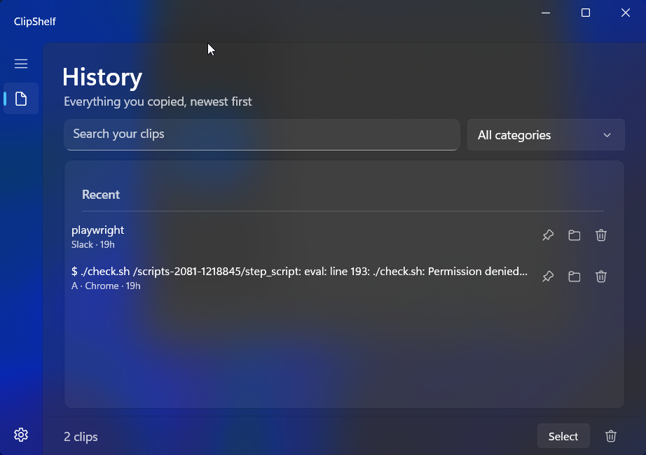
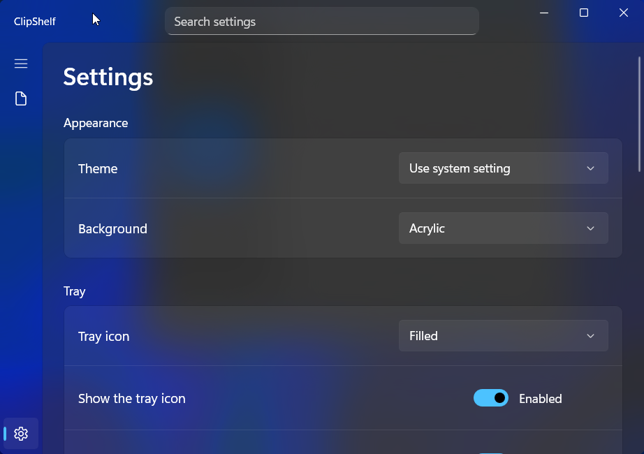
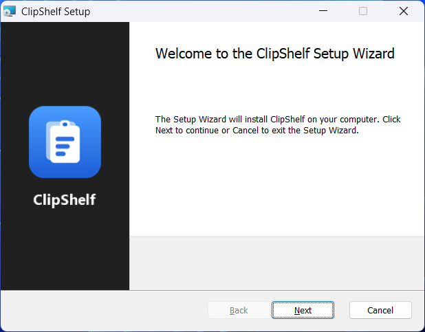

# ClipShelf

ClipShelf is a Windows clipboard-history app that keeps recently copied text searchable and ready to paste from a floating flyout or the system tray.

## Screenshots

Show screenshots

The clipboard flyout opens next to the mouse pointer; pick a clip to paste it into the app you came from.

The full history window: search, categories, pinned and recent clips, multi-select copy.

Settings: themes and background, the tray, behavior, history, export and category locks.

The installer wizard, with the MIT license, install location and finish-page options.

## Features

**Capture and history**
- Capture copied text into a local SQLite history; re-copying a clip moves it to the top instead of duplicating it.
- Copied images are kept alongside text, shown as thumbnails, and paste back as images (multi-copy and export cover text clips).
- Browse the full history in its own window, grouped into Pinned and Recent, with readable app names ("Chrome", "Word") and relative times.
- Search the history, pin clips, delete single clips, or clear everything unpinned; a placeholder explains an empty history, an empty search and an empty category.

**The flyout**
- Open the floating flyout with `Win+Shift+V` or a single tray click; it appears next to the mouse pointer and closes when you click anywhere else.
- Pick a clip to copy it and paste it into the app you came from; ↑/↓ move through the clips, Enter pastes the selected one, and Ctrl+1…9 paste one of the first nine.
- Select several clips and copy them together as one multi-line text.

**Categories**
- Save clips into named categories from the folder button on any row; create a category on the spot, and rename or delete them in Settings.
- Filter the full history by category; categorized clips are kept out of Clear, the history limit and retention.
- Lock a category to hide its clips from the history, the flyout, search and exports; opening it asks for the password.
- Choose when locks return — on exit, on minimize, or on shutdown/sign-out.

**Export**
- Export the text history to JSON or CSV from Settings, including each clip's category.
- One password (stored only as a salted hash) guards exporting and locked categories.

**Appearance**
- Themes: System, Light (pure white surfaces), Dark and Full black.
- Backgrounds where supported: Mica, Mica Alt, Acrylic or solid.

**Tray and behavior**
- Filled or outline tray icon, hide the tray icon, and choose whether a tray double-click opens the full history.
- Record a new global shortcut, run at Windows startup, cap the history size, and set retention (1 day, 7 days, 30 days or forever).
- Optionally clear unpinned history when you sign out or shut down; a search box in the title bar finds any setting.
- Check for a newer release from Settings — ClipShelf looks once per run and links to the download.
- A welcome window on the first run explains the hotkey and that ClipShelf lives in the tray.

**Privacy**
- The history database is SQLCipher-encrypted with a random key protected by Windows DPAPI for your account.
- Temporary storage stays in memory, freed memory is scrubbed, and a test proves the database, its sidecars and backups contain no readable clip text.
- Start in the notification area and keep history and settings on this PC under `%LOCALAPPDATA%\ClipShelf`.

The default shortcut is `Win+Shift+V`; change it in Settings if another app has already registered it.

## Performance

Load-tested through the real encrypted storage pipeline — details and numbers in [docs/performance.md](docs/performance.md):

- 10,000 clips insert in about 2 seconds (~0.2 ms per copy), and the flyout's first page stays under a millisecond.
- Trimming the history to the limit costs a partial-index seek proportional to the limit; a million stored clips no longer slow captures down (7.6 s per copy before the fix, about 1 ms after).
- Search stays within a few milliseconds at the 1,000-item Settings maximum; storage is about 0.43 KB per text clip.

## Requirements

- Windows 10 version 1809 or later, or Windows 11 (x64)
- For development: the .NET 10 SDK version pinned in `global.json`

## Scripts

| Script | Purpose |
|---|---|
| `run.bat` | Run the app in Debug (it starts in the notification area) |
| `build.bat` | Publish `ClipShelf.exe` to `artifacts\publish\win-x64` |
| `test.bat` | Run all tests |
| `package.bat` | Test, build and create the MSI in `artifacts\installer` |
| `clean.bat` | Remove all build output |

Pass `--no-pause` to skip the final key press (used by automation).

## Project structure

| Project | Responsibility |
|---|---|
| `src/ClipShelf.App` | WinUI 3 (Windows App SDK 1.x, unpackaged) UI, tray integration, clipboard flyout, and app startup |
| `src/ClipShelf.Core` | Domain models, interfaces, pure logic (no UI, no SQL) |
| `src/ClipShelf.Data` | SQLite + Dapper repositories and numbered SQL migrations |
| `tests/*` | xUnit v3 tests per project |
| `installer` | WiX v6 MSI |

Details: [docs/architecture.md](docs/architecture.md).

## Data locations

All user data is in `%LOCALAPPDATA%\ClipShelf\`:

| Path | Contents |
|---|---|
| `data.db` | Local SQLite clipboard-history database (SQLCipher-encrypted) |
| `key.bin` | The database key, protected with Windows DPAPI for the current user |
| `backups\` | Automatic backups (newest 14) |
| `logs\` | Daily log files (newest 14) |
| `cache\` | Rebuildable cache, safe to delete |
| `settings.json` | User settings |

Uninstalling keeps this folder. The history database is encrypted with SQLCipher; the key in `key.bin` is protected for the current Windows user, so keep it together with `data.db` — without it the history cannot be read.

## Localization

The UI is currently English-only. `Strings.resx` (neutral) and `Strings.en.resx` contain matching English text and keys. Dates and numbers follow the system locale. See [docs/localization.md](docs/localization.md).

## Contributing

- Commit title: `<project>: <type>: <short title>`, 60 characters at most, imperative, English. Projects: `app`, `core`, `data`, `tests`, `installer`, `docs`, `repo`. Types: `feat`, `fix`, `perf`, `refactor`, `test`, `docs`, `build`, `chore`, `i18n`, `style`.
- Commit body: what changed and why, wrapped at 72 characters.
- CI runs `test.bat` on every push to `main` and every pull request, and publishes a GitHub release with the MSI when a `vX.Y.Z` tag (matching `Version` in `Directory.Build.props`) is pushed.
- Before committing, `build.bat` and `test.bat` must pass, and the affected docs must be updated.
- Decisions: [docs/decisions](docs/decisions).

## Releases

Version is set in `Directory.Build.props`. Process: [docs/release.md](docs/release.md). History: [CHANGELOG.md](CHANGELOG.md). winget manifests: [packaging/winget](packaging/winget) (see [docs/winget.md](docs/winget.md)).

## Built with

This app follows [wpf-fluent-skill](https://github.com/ai94iq/wpf-fluent-skill) — the agent skill that fixed the stack (WinUI 3, .NET 10, SQLite, WiX), the project layout and the UI rules used throughout.

## License

MIT — see [LICENSE](LICENSE). Bundled fonts are under the SIL Open Font License (`src/ClipShelf.App/Assets/Fonts/OFL.txt`).
